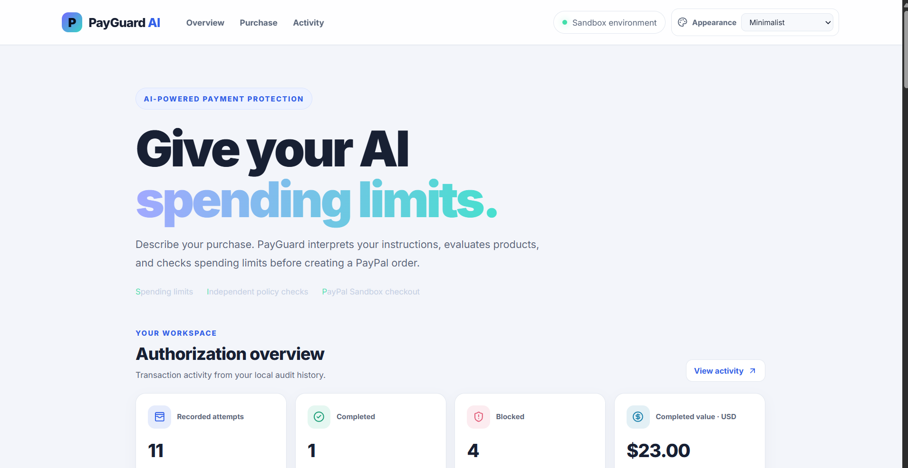
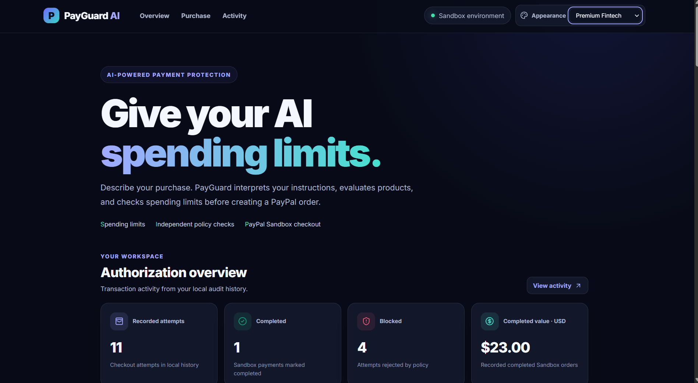
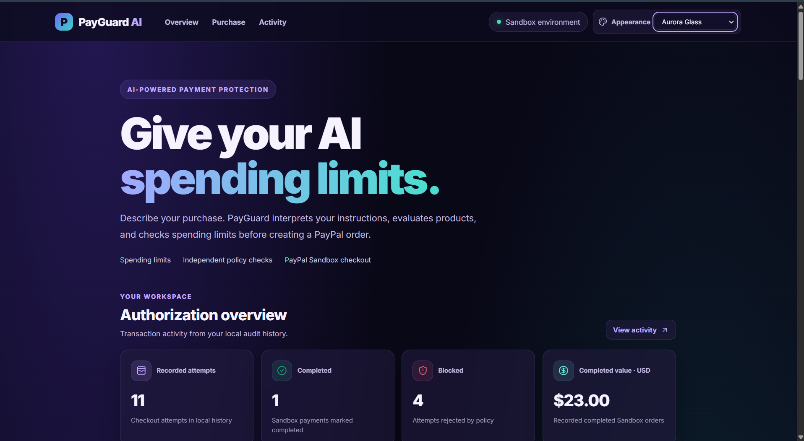
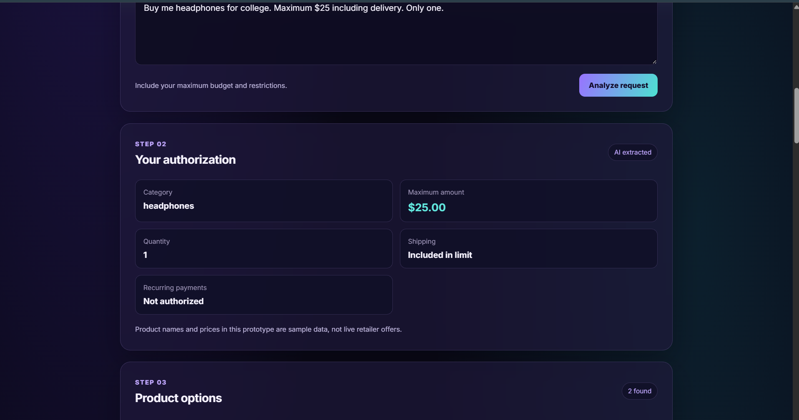
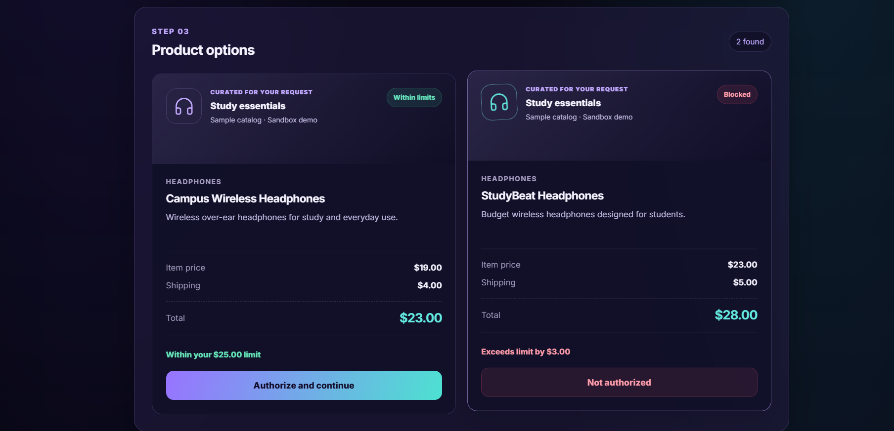
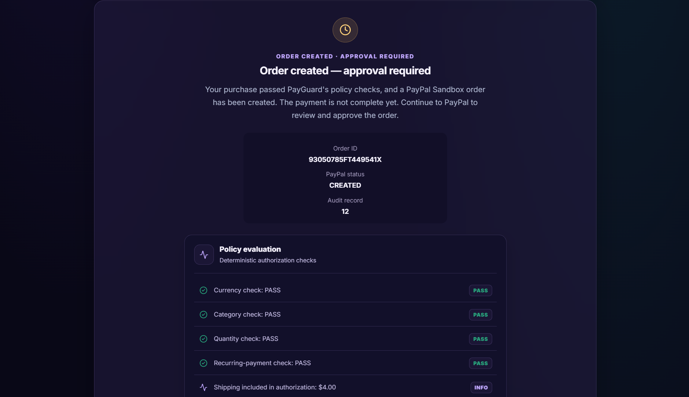
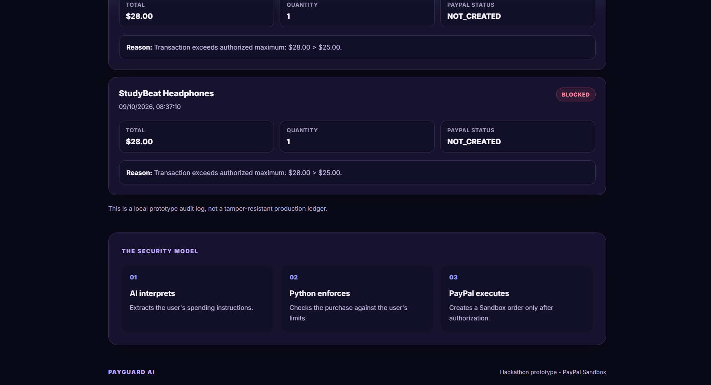

# PayGuard AI

### An AI-Assisted Authorization Layer for AI-Initiated Payments

PayGuard AI is a hackathon prototype exploring how AI-driven purchases can be checked against explicit user authorization before a PayPal payment order is created.

Users describe what they want to purchase in natural language. A local Llama model extracts a structured payment intent, and a deterministic Python policy engine evaluates the proposed transaction.

Only transactions that pass the policy checks can proceed to PayPal Sandbox order creation. The buyer must still approve checkout through PayPal.

> **Project status:** Hackathon prototype. This application uses a local sample product catalog, PayPal Sandbox, and a local SQLite audit log. It is not production payment infrastructure.

## Why PayGuard AI?

AI models can interpret instructions, but payment authorization requires predictable rules.

PayGuard AI separates AI-based interpretation from deterministic transaction authorization.

**Core principle: AI interprets the request; Python policy checks control payment authorization.**

## Key Features

- Natural-language payment intent extraction using Llama 3.2.
- Structured data validation with Pydantic.
- Budget and currency enforcement.
- Product category and quantity restrictions.
- Shipping-cost checks when shipping is included in the authorization.
- Recurring-payment restrictions.
- PayPal Sandbox checkout and server-side capture.
- SQLite transaction history and authorization decisions.
- React dashboard with transaction history.
- Checkout quantity validation.

## How It Works

1. The user describes a purchase.
2. The local Llama model extracts the user's authorization.
3. PayGuard AI retrieves a product from its sample catalog.
4. The backend constructs the proposed transaction.
5. Python policy checks evaluate the transaction.
6. Rejected transactions are recorded without creating a PayPal order.
7. Authorized, supported transactions proceed to PayPal Sandbox.
8. The buyer approves checkout.
9. The backend processes the return flow and records the payment status.

## Technology Stack

**Frontend:** React, Vite, JavaScript, CSS.

**Backend:** Python, FastAPI, Pydantic, Requests, SQLite.

**AI:** Ollama with the Llama 3.2 3B model.

**Payments:** PayPal Developer Sandbox and the PayPal Orders API.

## Prerequisites

Before running PayGuard AI, install:

- Python 3.12 or a compatible version.
- Node.js 24 and npm.
- Ollama.
- A PayPal Developer account with Sandbox credentials.

## Install the Backend

Create and activate a Python virtual environment from the project root:

    python3 -m venv .venv
    source .venv/bin/activate

Install the backend dependencies:

    python -m pip install -r requirements.txt

## Set Up the AI Model

Install Ollama using the official instructions:

https://ollama.com/download

Download the Llama model:

    ollama pull llama3.2:3b

Check that the model is available:

    ollama list

The Ollama application and model must be available locally for AI-powered features to work.

## Configure PayPal Sandbox

Create a Sandbox application in the PayPal Developer Dashboard and obtain
your Sandbox client ID and client secret.

When setting up a fresh copy of the project, create the local environment
file by copying the example template:

    cp .env.example .env

Edit the new .env file and replace the placeholder values with your own
Sandbox credentials.

Environment variables (APP_BASE_URL defaults to http://localhost:8000 if omitted):

- PAYPAL_CLIENT_ID: Sandbox application client ID.
- PAYPAL_CLIENT_SECRET: Sandbox application client secret.
- PAYPAL_BASE_URL: PayPal Sandbox API endpoint.
- APP_BASE_URL: Backend URL for checkout returns and cancellations.

Never commit .env or publish your client secret.

## Run the Application

### Start the Backend

Open a terminal in the project root and activate the Python environment:

    cd ~/payguard-ai
    source .venv/bin/activate

Start the FastAPI server:

    python -m uvicorn backend.main:app --reload --host 0.0.0.0 --port 8000

Keep this terminal running.

The interactive API documentation is available at:

http://localhost:8000/docs

### Start the Frontend

Open a second terminal and navigate to the frontend directory:

    cd ~/payguard-ai/frontend

Install the dependencies:

    npm ci

Start the Vite development server:

    npm run dev

Keep this terminal running.

Open the application in your browser:

http://localhost:5173

## Testing

### Run the Policy Engine Tests

From the project root, activate the Python virtual environment and run:

    cd ~/payguard-ai
    source .venv/bin/activate
    python -m backend.policy

The included policy scenarios cover an authorized transaction, a
transaction exceeding the spending limit, and a transaction exceeding
the authorized quantity.

### Build the Frontend

From the frontend directory, run:

    cd ~/payguard-ai/frontend
    npm run build

Vite generates the production frontend build in frontend/dist/.

These checks do not constitute a complete automated end-to-end test suite.

## Security and Design Principles

### Deterministic Authorization

The language model extracts the user's payment intent. Python policy checks
make the authorization decision for the supported transaction rules.

### Budget and Quantity Restrictions

The backend checks spending limits, shipping costs when applicable, and
the proposed purchase quantity against the user's authorization.

### Recurring Payments

Recurring subscriptions are blocked because subscription billing is not
implemented in this prototype.

### Audit History

The local SQLite database records transaction attempts, authorization
decisions, and PayPal order statuses. It is not a tamper-resistant ledger.

## Current Limitations

- The product catalog contains sample products and prices, not live retailer offers.
- Payments use PayPal Sandbox and do not represent real-money transactions.
- Recurring subscription billing is not implemented.
- The local audit database is not tamper-resistant.
- The AI-extracted intent is not a cryptographic authorization.
- Production-grade authentication, deployment hardening, concurrency
  controls, and comprehensive automated end-to-end tests are not established.
- Ollama and the configured model must be available for AI-powered features.

This is a hackathon prototype. Do not use it for real-world payments
without a substantial security, reliability, compliance, and deployment review.

## License

This project is released under the MIT License. See [LICENSE](LICENSE) for the full license text.

## Screenshots

PayGuard AI is a hackathon prototype that uses a local sample
catalog and PayPal Sandbox to demonstrate AI-assisted purchase
authorization.

### 1. Dashboard Themes

#### Minimalist

#### Premium Fintech

#### Aurora Glass

### 2. Purchase Authorization

This view demonstrates the authorization details extracted from
the user's purchase request, including the spending limit,
quantity, shipping allowance, and recurring-payment restriction.

### 3. Product Comparison

PayGuard AI compares sample products against the user's budget
before allowing the user to continue.

### 4. Policy Evaluation and PayPal Sandbox

The application evaluates authorization rules before creating
a PayPal Sandbox order. Order creation is not the same as
payment completion; the buyer must still approve the order.

### 5. Transaction History and Audit Trail

The local audit history records transaction decisions and
their PayPal statuses. It is a prototype audit log, not a
tamper-resistant production ledger.

